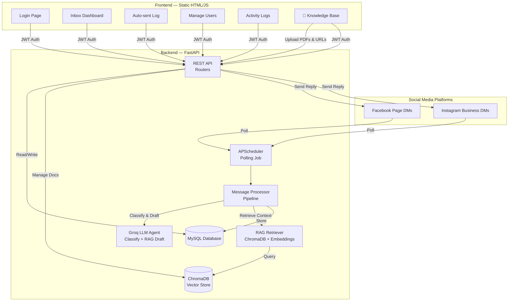
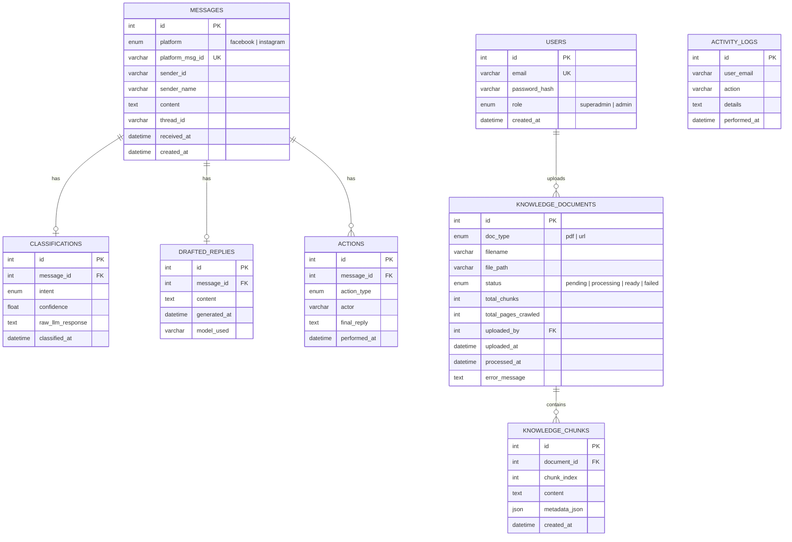
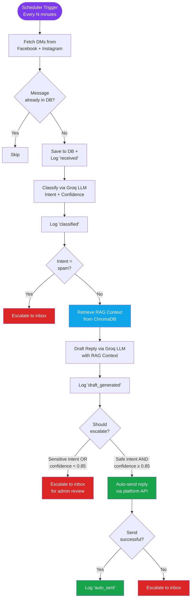
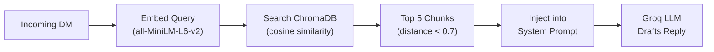

# Reputation Management Agent — Technical Documentation

> **Version:** 2.0 | **Last Updated:** Feb 23, 2026 | **Company:** Auxilo Finserve

---

## 1. Overview

The **Reputation Management Agent** is an AI-powered system that automatically monitors, classifies, and responds to direct messages (DMs) received on Auxilo Finserve's Facebook and Instagram social media pages.

### Core Capabilities
- **Automated Polling** — Periodically fetches new DMs from Facebook and Instagram
- **AI Classification** — Classifies each message into intents (lead, support, complaint, etc.)
- **AI Draft Reply** — Generates a professional reply using LLM, augmented with company knowledge (RAG)
- **Smart Routing** — Auto-sends high-confidence replies; escalates uncertain ones for admin review
- **Admin Dashboard** — Web interface for reviewing, approving, editing, and rejecting messages
- **Knowledge Base (RAG)** — Upload PDFs and scan websites to train the AI with company-specific knowledge
- **User Management** — Role-based access (superadmin / admin)
- **Activity Logging** — Audit trail of all user and system actions
- **Token Management** — Auto-exchange of Meta API tokens for permanent access

---

## 2. Architecture



---

## 3. Tech Stack

| Component | Technology | Version |
|-----------|-----------|---------|
| Backend Framework | FastAPI | 0.111.0 |
| ASGI Server | Uvicorn | 0.29.0 |
| ORM | SQLAlchemy (async) | 2.0.30 |
| Database | MySQL (aiomysql) | 0.2.0 |
| Vector Database | ChromaDB (persistent) | 0.4.24 |
| Embeddings | sentence-transformers (all-MiniLM-L6-v2) | 3.0.1 |
| LLM API | Groq (Llama 3.3 70B) | v1 |
| Social APIs | Meta Graph API | v18.0 |
| HTTP Client | httpx | 0.27.0 |
| Scheduler | APScheduler | 3.10.4 |
| Auth | python-jose (JWT) + passlib (bcrypt) | 3.3.0 / 1.7.4 |
| Rate Limiting | slowapi | 0.1.9 |
| PDF Parsing | PyPDF2 | 3.0.1 |
| Web Scraping | BeautifulSoup4 + lxml | 4.12.3 / 5.2.2 |
| Config | pydantic-settings | 2.2.1 |
| Frontend | HTML + Vanilla CSS + Vanilla JS | — |

---

## 4. Project Structure

```
Reputation_Management_Agent/
├── .env                              # All environment variables
├── backend/
│   ├── main.py                       # FastAPI app, lifespan, router registration
│   ├── requirements.txt              # Python dependencies
│   ├── schema.sql                    # Reference SQL schema
│   ├── data/                         # Runtime data (auto-created)
│   │   ├── uploads/                  # Uploaded PDF files
│   │   └── chromadb/                 # ChromaDB vector persistence
│   └── app/
│       ├── config.py                 # Pydantic Settings (loads .env)
│       ├── database.py               # Async SQLAlchemy engine & session
│       ├── auth.py                   # JWT, password hashing, auth dependencies
│       ├── scheduler.py              # APScheduler setup (polling job)
│       ├── models/
│       │   ├── user.py               # User model (email, role)
│       │   ├── message.py            # Message, Classification, DraftedReply
│       │   ├── action.py             # Action audit trail (per-message)
│       │   ├── activity_log.py       # ActivityLog (system-wide audit)
│       │   └── knowledge_document.py # 🧠 KnowledgeDocument + KnowledgeChunk models
│       ├── schemas/
│       │   ├── auth.py               # LoginRequest, UserOut, CreateUserRequest
│       │   ├── message.py            # MessageOut, ApproveRequest, RejectRequest
│       │   ├── action.py             # ActionOut schema
│       │   └── knowledge.py          # 🧠 URLUploadRequest, DocumentOut, SearchResult
│       ├── routers/
│       │   ├── auth.py               # POST /api/auth/login
│       │   ├── messages.py           # GET/POST pending, auto-sent, approve, reject
│       │   ├── users.py              # CRUD /api/users (superadmin only)
│       │   ├── activity.py           # GET /api/activity (superadmin only)
│       │   ├── token.py              # POST /api/token/exchange
│       │   └── knowledge.py          # 🧠 Knowledge Base CRUD + search
│       └── services/
│           ├── facebook.py           # FB Graph API: fetch DMs + send replies
│           ├── instagram.py          # IG Graph API: fetch DMs + send replies
│           ├── groq_agent.py         # LLM: classify_message + RAG-augmented draft_reply
│           ├── message_processor.py  # Pipeline orchestrator (with RAG retrieval)
│           ├── log_activity.py       # Activity logging helper
│           ├── token_exchange.py     # Token exchange (short-lived → permanent)
│           └── knowledge/            # 🧠 RAG Pipeline
│               ├── pdf_parser.py     # Extract text from PDFs
│               ├── url_scraper.py    # Recursive full-site web crawler
│               ├── chunker.py        # Text splitting with overlap
│               ├── embedder.py       # sentence-transformers embeddings
│               ├── vector_store.py   # ChromaDB add/delete/query
│               ├── retriever.py      # RAG context retrieval for LLM
│               └── processor.py      # Full ingestion pipeline orchestrator
└── frontend/
    ├── login.html                    # Login page
    ├── inbox.html                    # Message review inbox
    ├── autosent.html                 # Auto-sent messages log
    ├── users.html                    # User management (superadmin)
    ├── activity.html                 # Activity logs (superadmin)
    ├── knowledge.html                # 🧠 Knowledge Base management (superadmin)
    ├── css/
    │   ├── variables.css             # Design tokens (colors, fonts, spacing)
    │   ├── base.css                  # Global resets and typography
    │   ├── login.css                 # Login page styles
    │   ├── sidebar.css               # Sidebar navigation styles
    │   ├── inbox.css                 # Inbox page styles
    │   ├── autosent.css              # Auto-sent page styles
    │   ├── users.css                 # User management page styles
    │   ├── activity.css              # Activity logs page styles
    │   └── knowledge.css             # Knowledge Base page styles
    └── js/
        ├── api.js                    # API wrapper (fetch, auth, token mgmt)
        ├── auth.js                   # Login/logout, JWT, role-based nav
        ├── inbox.js                  # Inbox page logic
        ├── autosent.js               # Auto-sent page logic
        ├── users.js                  # User management page logic
        ├── activity.js               # Activity logs page logic
        └── knowledge.js              # 🧠 Knowledge Base page logic
```

---

## 5. Database Schema

### 5.1 Entity Relationship Diagram



### 5.2 Intent Types

| Intent | Description | Auto-send? |
|--------|-------------|------------|
| `potential_lead` | Interested in education loans | ✅ If confidence ≥ 0.85 |
| `customer_support` | Existing customer query/complaint | ✅ If confidence ≥ 0.85 |
| `general_inquiry` | General questions about Auxilo | ✅ If confidence ≥ 0.85 |
| `sensitive_complaint` | Angry customer, legal threat, PR risk | ❌ Always escalated |
| `partnership_inquiry` | B2B or institutional interest | ❌ Always escalated |
| `spam` | Irrelevant/promotional messages | ❌ Always escalated |

### 5.3 Action Types

| Action | Description | Actor |
|--------|-------------|-------|
| `received` | Message fetched from platform | agent |
| `classified` | Intent classification complete | agent |
| `draft_generated` | Reply draft created by LLM | agent |
| `auto_sent` | Reply auto-sent (high confidence) | agent |
| `escalated` | Sent to inbox for admin review | agent |
| `approved` | Admin approved and sent the draft | admin email |
| `rejected` | Admin rejected the message | admin email |
| `edited_and_approved` | Admin edited draft then sent | admin email |

---

## 6. API Reference

**Base URL:** `http://localhost:8000`
**Auth:** Bearer JWT token in `Authorization` header

### 6.1 Authentication

| Method | Endpoint | Auth | Description |
|--------|----------|------|-------------|
| POST | `/api/auth/login` | ❌ | Login (rate limited: 5/min/IP) |

**Request:**
```json
{ "email": "admin@auxilo.com", "password": "password123" }
```
**Response:**
```json
{
  "access_token": "eyJ...",
  "token_type": "bearer",
  "user": { "email": "admin@auxilo.com", "role": "superadmin" }
}
```

### 6.2 Messages

| Method | Endpoint | Auth | Description |
|--------|----------|------|-------------|
| GET | `/api/messages/pending` | ✅ | Get escalated messages for review |
| GET | `/api/messages/auto-sent` | ✅ | Get auto-sent messages log (paginated) |
| POST | `/api/messages/trigger-poll` | ✅ | Manually trigger a polling cycle |
| POST | `/api/messages/{id}/approve` | ✅ | Approve and send reply |
| POST | `/api/messages/{id}/reject` | ✅ | Reject without sending |
| POST | `/api/messages/{id}/regenerate` | ✅ | Regenerate draft via LLM |

### 6.3 User Management (Superadmin Only)

| Method | Endpoint | Auth | Description |
|--------|----------|------|-------------|
| GET | `/api/users/` | 🔒 superadmin | List all users |
| POST | `/api/users/` | 🔒 superadmin | Create new user |
| DELETE | `/api/users/{id}` | 🔒 superadmin | Delete user (cannot self-delete) |

### 6.4 Activity Logs (Superadmin Only)

| Method | Endpoint | Auth | Description |
|--------|----------|------|-------------|
| GET | `/api/activity/` | 🔒 superadmin | Paginated logs (filter by user, action) |
| GET | `/api/activity/actions` | 🔒 superadmin | Distinct action types |
| GET | `/api/activity/users` | 🔒 superadmin | Distinct user emails |

### 6.5 Token Management (Superadmin Only)

| Method | Endpoint | Auth | Description |
|--------|----------|------|-------------|
| POST | `/api/token/exchange` | 🔒 superadmin | Exchange short-lived token for permanent |

### 6.6 Knowledge Base (Superadmin Only)

| Method | Endpoint | Auth | Description |
|--------|----------|------|-------------|
| POST | `/api/knowledge/upload-pdf` | 🔒 superadmin | Upload a PDF document (multipart/form-data) |
| POST | `/api/knowledge/add-url` | 🔒 superadmin | Submit URL for recursive full-site crawling |
| GET | `/api/knowledge/documents` | 🔒 superadmin | List all knowledge documents (filter by status/type) |
| GET | `/api/knowledge/documents/{id}` | 🔒 superadmin | Get document details including text chunks |
| DELETE | `/api/knowledge/documents/{id}` | 🔒 superadmin | Delete document + vectors from ChromaDB |
| POST | `/api/knowledge/documents/{id}/reindex` | 🔒 superadmin | Re-process and re-index a document |
| GET | `/api/knowledge/search?q=...` | 🔒 superadmin | Test semantic search against knowledge base |
| GET | `/api/knowledge/stats` | 🔒 superadmin | Knowledge base statistics (docs, chunks, vectors) |

---

## 7. Message Processing Pipeline



---

## 8. Authentication & Authorization

### 8.1 JWT Flow
1. User submits email + password → `POST /api/auth/login`
2. Server verifies against `users` table (bcrypt hashed password)
3. Returns JWT with payload: `{ sub: email, role: "superadmin"|"admin" }`
4. Frontend stores JWT in `localStorage.auth_token`
5. All API calls include `Authorization: Bearer <token>`
6. JWT expires after 24 hours (configurable via `ACCESS_TOKEN_EXPIRE_MINUTES`)

### 8.2 Roles

| Feature | Admin | Superadmin |
|---------|:-----:|:----------:|
| View Inbox (pending messages) | ✅ | ✅ |
| Approve / Reject / Regenerate | ✅ | ✅ |
| View Auto-sent Log | ✅ | ✅ |
| Manage Users | ❌ | ✅ |
| View Activity Logs | ❌ | ✅ |
| Exchange API Tokens | ❌ | ✅ |
| Manage Knowledge Base | ❌ | ✅ |

### 8.3 Admin Seeding
On first startup, the system auto-creates a superadmin user from environment variables:
- `ADMIN_EMAIL` (default: `superadmin@auxilo.com`)
- `ADMIN_PASSWORD` (default: `changeme123`)

---

## 9. LLM Integration (Groq)

### 9.1 Classification
- **Model:** Llama 3.3 70B Versatile
- **Temperature:** 0.1 (deterministic)
- **Output:** JSON `{ intent, confidence, reason }`
- **Fallback:** If `intent` is unrecognized → defaults to `general_inquiry`

### 9.2 Reply Drafting
- **Model:** Llama 3.3 70B Versatile
- **Temperature:** 0.7 (creative)
- **Output:** Plain text professional reply
- **Context:** Intent type, sender name, company guidelines, **RAG knowledge context**
- **RAG Integration:** Before drafting, the processor retrieves relevant text chunks from ChromaDB and injects them into the system prompt

### 9.3 RAG (Retrieval-Augmented Generation)

The RAG system enhances reply quality by grounding responses in real company knowledge:



**Pipeline Components:**
| Service | File | Purpose |
|---------|------|---------|
| PDF Parser | `pdf_parser.py` | PyPDF2 page-by-page extraction |
| URL Scraper | `url_scraper.py` | Recursive BFS same-domain crawler |
| Chunker | `chunker.py` | Recursive splitting (2000 chars, 200 overlap) |
| Embedder | `embedder.py` | sentence-transformers lazy-loaded model |
| Vector Store | `vector_store.py` | ChromaDB persistent collection |
| Retriever | `retriever.py` | Query embedding + relevance filtering |
| Processor | `processor.py` | Full ingestion orchestrator |

### 9.4 Guardrails
- No specific interest rates or loan amounts promised
- Sensitive complaints get empathetic response + senior follow-up assurance
- Partnership inquiries directed to `partnerships@auxilo.com`
- No hashtags or excessive emojis

---

## 10. Meta Graph API Integration

### 10.1 Facebook
- **Fetch:** `GET /{page_id}/conversations` → `GET /{conv_id}/messages`
- **Send:** `POST /me/messages` (Send API)
- **Filters:** Skips messages sent by the page, empty messages

### 10.2 Instagram
- **Fetch:** `GET /{page_id}/conversations?platform=instagram`
- **Send:** `POST /{page_id}/messages`
- **Filters:** Skips messages from own IG account or page ID

### 10.3 Token Management
Short-lived tokens (1 hour) can be exchanged for **never-expiring page tokens** via:

```
Short-lived User Token (1 hr)
    → Long-lived User Token (60 days)
        → Page Access Token (NEVER expires)
```

**Endpoint:** `POST /api/token/exchange`
- Auto-updates `.env` file
- Updates runtime settings (no restart needed)

---

## 11. Frontend Pages

| Page | URL | Access | Description |
|------|-----|--------|-------------|
| Login | `login.html` | Public | Email + password login with rate limiting feedback |
| Inbox | `inbox.html` | All users | Review escalated messages, approve/reject/edit/regenerate |
| Auto-sent | `autosent.html` | All users | View auto-sent replies with filters and pagination |
| Manage Users | `users.html` | Superadmin | Add/delete users, assign roles |
| Activity Logs | `activity.html` | Superadmin | Filterable audit log of all user actions |
| **Knowledge Base** | `knowledge.html` | Superadmin | 🧠 Upload PDFs, scan URLs, test search, manage docs |

### Design System
- Dark theme with CSS custom properties (variables)
- Responsive sidebar navigation
- Role-based nav visibility (superadmin-only items hidden for admins)
- Action badges with color coding (green = approved, red = rejected, orange = pending)
- Toast notifications for success/error feedback
- Modal dialogs for create/delete confirmations

---

## 12. Environment Variables

| Variable | Description | Example |
|----------|-------------|---------|
| `APP_ENV` | Environment mode | `development` |
| `SECRET_KEY` | JWT signing key | `random_64_char_string` |
| `ACCESS_TOKEN_EXPIRE_MINUTES` | JWT token lifetime | `1440` (24 hours) |
| `APP_ID` | Meta App ID | `1625210535338747` |
| `APP_SECRET` | Meta App Secret | `78ef2e...` |
| `FB_PAGE_ID` | Facebook Page ID | `969597406242160` |
| `FB_PAGE_ACCESS_TOKEN` | Facebook Page token | `EAAX...` |
| `IG_USER_ID` | Instagram User ID | `17841458510377324` |
| `IG_PAGE_ACCESS_TOKEN` | Instagram Page token | `EAAX...` |
| `GROQ_API_KEY` | Groq API key | `gsk_...` |
| `GROQ_MODEL` | Groq model name | `llama-3.3-70b-versatile` |
| `DATABASE_URL` | MySQL connection string | `mysql+mysqlconnector://...` |
| `AUTO_SEND_CONFIDENCE_THRESHOLD` | Min confidence for auto-send | `0.85` |
| `POLLING_INTERVAL_MINUTES` | Polling frequency | `2` |
| `CHROMA_PERSIST_DIR` | ChromaDB persistence directory | `./data/chromadb` |
| `EMBEDDING_MODEL` | Embedding model name | `all-MiniLM-L6-v2` |
| `RAG_CHUNK_SIZE` | Max characters per chunk | `2000` |
| `RAG_CHUNK_OVERLAP` | Overlap between chunks | `200` |
| `RAG_TOP_K` | Chunks to retrieve per query | `5` |
| `UPLOAD_DIR` | PDF upload storage path | `./data/uploads` |
| `RAG_MAX_CRAWL_DEPTH` | Max crawl depth | `3` |
| `RAG_MAX_CRAWL_PAGES` | Max pages per crawl | `50` |
| `ADMIN_EMAIL` | Seed superadmin email | `superadmin@auxilo.com` |
| `ADMIN_PASSWORD` | Seed superadmin password | `auxilo123` |

---

## 13. Deployment

### Local Development
```bash
# Backend
cd backend
python3 -m venv venv
source venv/bin/activate
pip install -r requirements.txt
uvicorn main:app --reload --port 8000

# Frontend (any static file server)
cd frontend
python3 -m http.server 5500
```

### Production Considerations
- Replace `SECRET_KEY` with strong random value
- Set `APP_ENV=production` (disables SQL echo)
- Use a reverse proxy (nginx) for frontend + API
- Enable HTTPS
- Set up database backups
- Monitor Groq API usage and rate limits
- Submit Meta app for review (enables messaging for all users, not just testers)

---

## 14. Security

| Security Feature | Implementation |
|-------------------|---------------|
| Password Storage | bcrypt hashing (passlib) |
| Authentication | JWT with HS256 signing |
| Rate Limiting | 5 login attempts/min/IP (slowapi) |
| CORS | Configurable origins |
| Role-Based Access | `require_superadmin` dependency |
| Self-Delete Prevention | Users cannot delete their own account |
| Token Expiry | JWT expires after configurable duration |
| Input Validation | Pydantic schemas for all request bodies |
| SQL Injection | SQLAlchemy parameterized queries |

---

*Document generated for the Reputation Management Agent project v2.0 — Auxilo Finserve*
